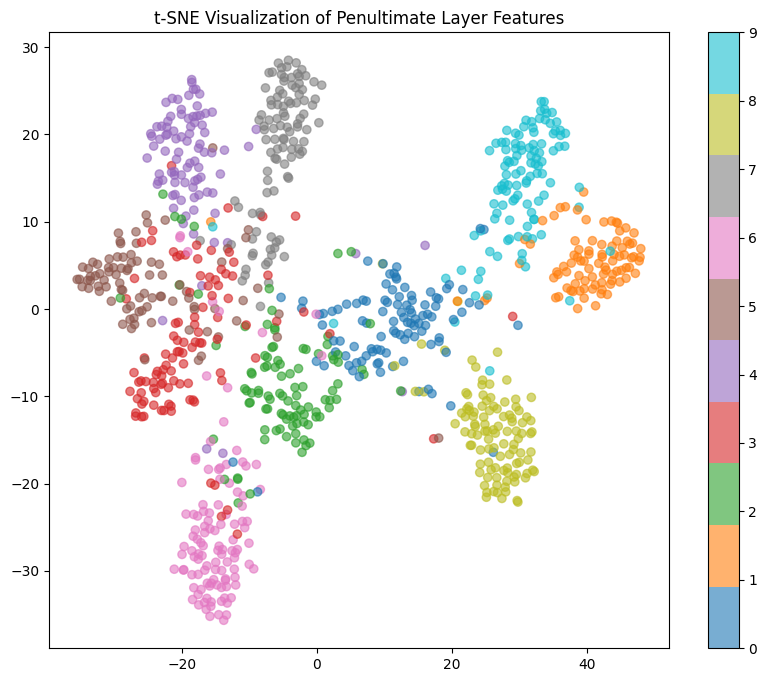
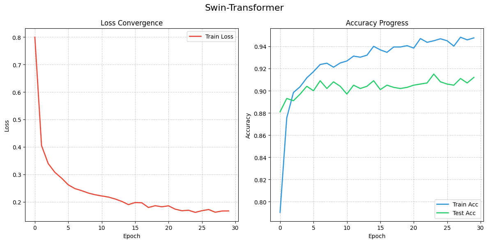
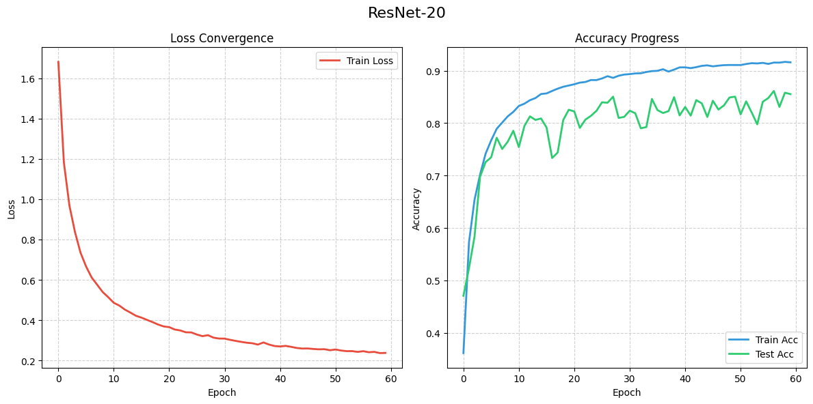
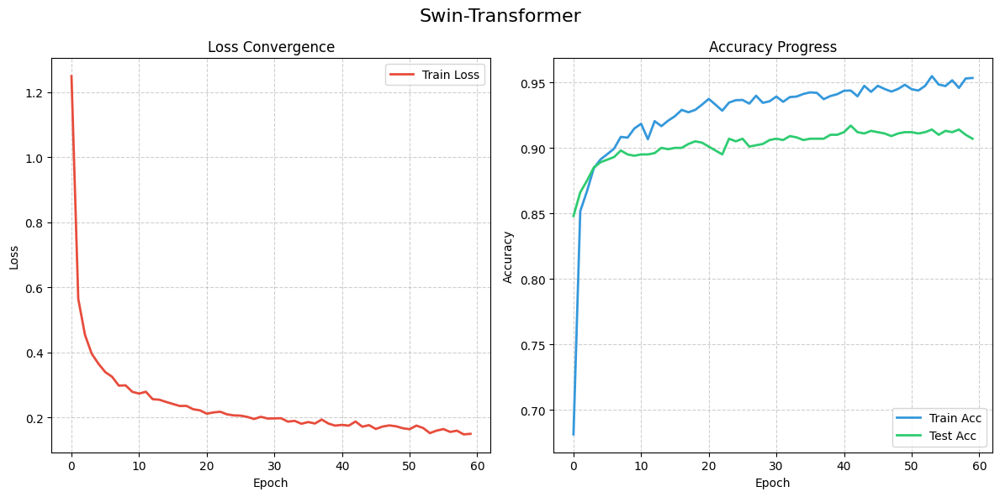

# DSAI5201 Project: CIFAR-10 Classification with ResNet-20 and Swin Transformer

This project compares a manually implemented **ResNet-20** and a fine-tuned **Swin Transformer (swin_t)** on the CIFAR-10 dataset.

The workflow includes:
- Data preprocessing and augmentation
- Model training and validation
- Final test evaluation (Accuracy + Macro F1)
- Feature visualization with t-SNE
- Checkpoint saving and resume training

---

## Project Structure

```text
DSAI5201/
├── DSAI5201_1.ipynb        # Main experiment notebook
├── train_utils.py          # Training/evaluation utilities
├── checkpoints/            # Saved model checkpoints
│   ├── resnet20/
│   └── swin/
├── data/                   # CIFAR-10 local data
└── pic/                    # Result figures used in README
```

---

## Methods

### 1) Dataset and Preprocessing
- Dataset: **CIFAR-10**
- Train/Validation split: **90% / 10%** from the official training set
- Test set: official CIFAR-10 test split
- Normalization (used in the notebook):
  - Mean: `[0.4914, 0.4822, 0.4465]`
  - Std: `[0.2470, 0.2435, 0.2616]`
- Data augmentation for ResNet training:
  - `RandomCrop(32, padding=4)`
  - `RandomHorizontalFlip()`

### 2) Models
- **ResNet-20 (custom implementation)**
  - Basic residual blocks
  - Outputs both logits and penultimate-layer features
- **Swin Transformer (swin_t)**
  - Pretrained ImageNet weights
  - Head replaced for 10 CIFAR classes
  - Input resized from `32x32` to `224x224` for Swin branch

### 3) Training and Evaluation
- Shared utilities are provided in `train_utils.py`:
  - `get_device()` (supports Apple MPS, CUDA, and CPU)
  - `get_dataloaders()`
  - `train_and_eval_visualized()` (live curves + checkpoints)
- Evaluation metrics:
  - Top-1 Accuracy
  - Macro F1-score
- Feature analysis:
  - t-SNE on penultimate-layer features (sampled test images)

---

## Environment

Recommended:
- Python 3.10+
- PyTorch + TorchVision
- scikit-learn
- matplotlib
- Jupyter

Install dependencies (example):

```bash
pip install torch torchvision scikit-learn matplotlib notebook
```

---

## How to Run

1. Open `DSAI5201_1.ipynb`.
2. Run cells from top to bottom in order.
3. Training checkpoints will be saved to:
   - `checkpoints/resnet20/`
   - `checkpoints/swin/`

### Notes for macOS / Apple Silicon
- The code can automatically use Apple GPU (`mps`) when available.
- In Jupyter on macOS, using `num_workers=0` is recommended for stability.
- If kernel crashes persist, reduce batch size and clear memory between model trainings.

---

## Results Visualization

### Training / Evaluation Curves





### Feature Visualization / Additional Outputs





---

## Key Outputs

- Best model checkpoints (`best_model.pth`) for both model families
- Latest training states (`latest_model.pth`) for resume training
- Test metrics (Accuracy and Macro F1)
- t-SNE feature distribution plots

---

## Acknowledgements

- CIFAR-10 dataset (via TorchVision)
- ResNet architecture (He et al.)
- Swin Transformer implementation from TorchVision
